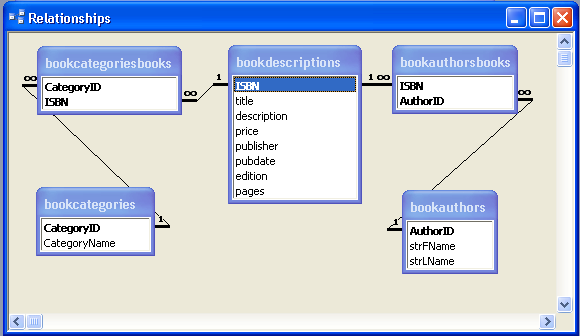

# Bookstore Project

[GeekBooks](http://yorktown.cbe.wwu.edu/sandvig/mis314/assignments/bookstore/), has the basic functionality of an on-line store with product information, a shopping cart, and a checkout process. Your bookstore will have this functionality at the completion of assignment 9. You may add additional enhancements to earn a higher grade on the term project. Information about possible enhancements is located under the "project' link on the course web site.

## Source

http://yorktown.cbe.wwu.edu/sandvig/mis314/assignments/assignment07.aspx
